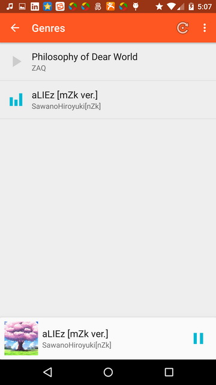
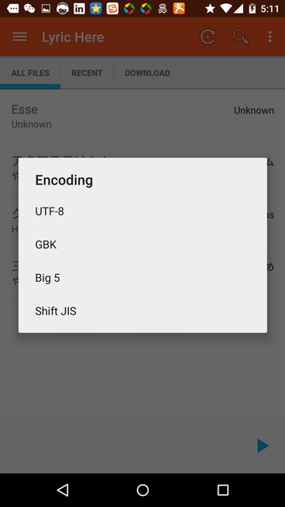

Lyric Here
==========
A music player focused on user experience of lyric.

Pre-requisites
--------------

- Android SDK v14

Features
-----------

- Local music browser and player.
- Music player widget, notification widget.
- Lyric directly refresh on notification, see it whenever you want.
- Powerful LyricView which supports scrolling up and down to change offset.
- Receive broadcast from popular music players and pop up lyric open notification.

TODO(Pull request is welcomed)
------------------------------

- Extract artwork from local media files and show in list.
- Better implementation for Music player.
- Download from server(well, i myself will build the server side)
- Add support lyric file encoding auto-recognize.
- Use Google Data Binding and Dagger2

Screenshots
-----------

CHANGELOG
-------

- Add music player, refactor UI to material design.
- Add recent played lyric feature.
- A lyric player which can play local lrc files.

LIBRARY
-------

- Butter Knife
- DBFlow
- base-adapter-helper