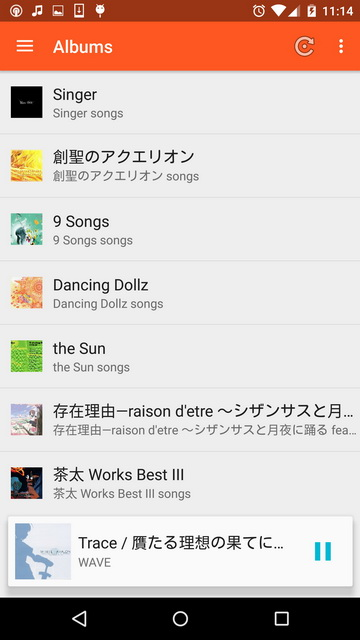
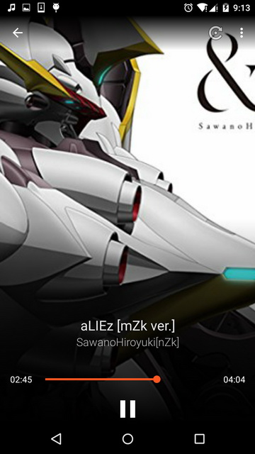
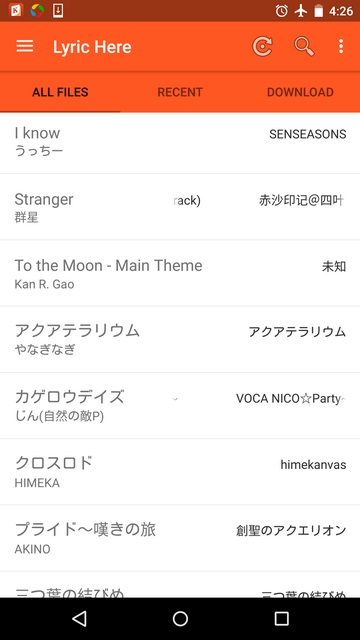
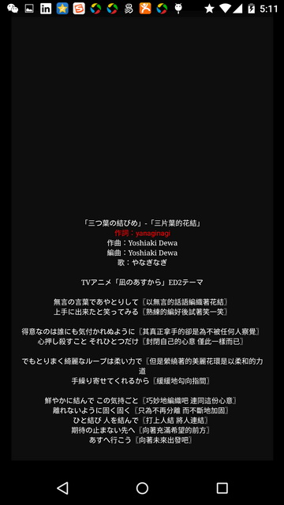
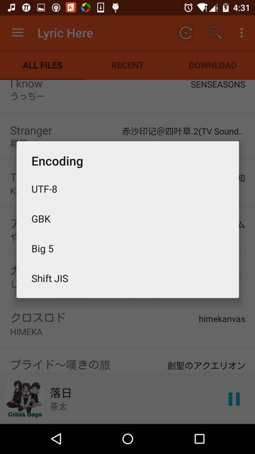
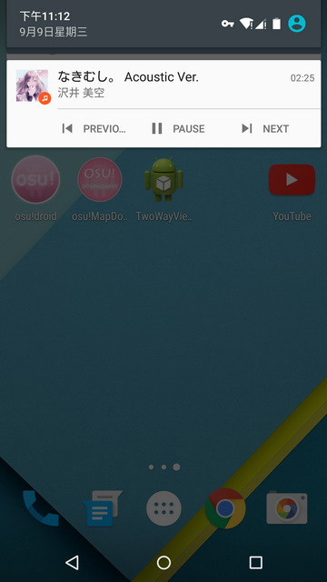
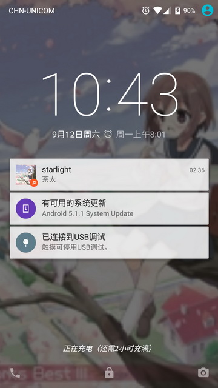

Lyric Here 
==========
Material design music and lyric player. Using Android's new android.media.MediaMetadata series api to implement. ([For Chinese 中文戳这里](https://github.com/markzhai/LyricHere/blob/master/README_CN.md))

Pre-requisites
--------------
- Android SDK v14

Features
-----------
- Local music browser and player.
- Music player widget, notification widget.
- Lyric directly refresh on notification, see it whenever you want.
- Powerful LyricView which supports scrolling up and down to change offset.
- Receive broadcast from popular music players and pop up lyric open notification.

TODO(Pull request is welcomed)
------------------------------

- Find some nice icons to replace currect genre, artist, album icon.
- Use Google Design Support UI (AppBar, CoordinatorLayout, etc.)
- Better implementation for Music player, show lyric directly.
- Download lyric from server and upload to server.
- Add support lyric file encoding auto-recognize.

Tested
------
- Nexus 6 (5.1.1)
- OnePlus (4.3)

Screenshots
-----------

LIBRARY
-------
- Android Support Library (cardview, appcompat, design, mediarouter)
- [Butter Knife](https://github.com/JakeWharton/butterknife)
- [DBFlow](https://github.com/Raizlabs/DBFlow)
- [Icepick](https://github.com/frankiesardo/icepick)
- [mosby](https://github.com/sockeqwe/mosby)
- [android-ColorPickerPreference](https://github.com/attenzione/android-ColorPickerPreference)
- [LyricView](https://github.com/markzhai/LyricView)